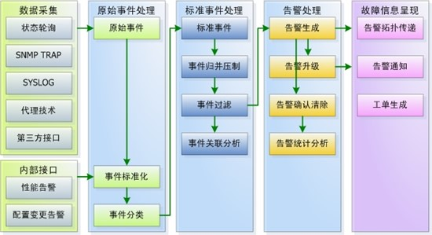

## 技术运营

技术运营是从技术方面支撑与完善IT系统日常运营保障、运营工具建设、运营决策辅助，从技术方面支撑业务运营，提升IT的业务价值，获得可持续竞争优势。
技术运营管理过程分为：监控管理、事件管理与变更管理、配置管理、容量与成本管理、高可用管理、业务连续性管理、用户体验管理等。
本章节将从通用工具以及上述运营管理过程所涉及工具的维度分别阐述。

### 1. 通用工具

通用工具使技术运营工具体系中最常使用的公共工具组件，这些工具组件在满足自身运营活动支撑以外还通过接口服务的方式向其他技术运营工具提供服务。

这些工具包含：配置管理平台CMDB、知识库、流程系统、运维数据仓库、通知管理等。

#### 1.1 配置管理平台CMDB

配置管理平台CMDB（Configuration Management Database）存储与管理企业IT架构中设备、组件、服务、应用与业务的各种配置信息，它与所有服务支持、服务交付等技术运营活动都紧密相连，支持这些技术运营活动运转、发挥配置信息的价值，同时依赖与相关运营活动保证数据的准确性。例如：持续集成与持续发布中的环境管理相关配置信息。

##### 应包含以下基本功能：

—— 面向IaaS、PaaS、SaaS层全面的IT资源管理能力；

—— 灵活的资源配置实例查询能力，可以通过配置项资源类型、资源配置项属性字段信息为必要字段灵活组合关联查询；

—— 资源实例数据导入、导出；

—— 资源视图管理，CMDB可以应用为核心、资源类型为核心、网络为核心、云平台为核心、地域为核心等多种视图方式展示与管理资源数据；

—— 配置信息采集功能，CMDB可以通过Agent、SSH、SNMP、IPMI、iLO、SIM-S、JDBC、JMX、API接口等方式自动采集资源实例配置信息；

—— 配置信息采集范围包含：主流服务器、存储、网络、操作系统、数据库、中间件、云平台、容器平台、能力服务组件等；

—— 配置信息采集能够自动生成网络连接关系、存储网络关系、软件（中间件、数据库）与服务器的部署关系、云资源关联关系（数据中心、资源池、集群、共享存储、物理机、虚拟机等资源实例之间关系）、容器关联关系（节点、集群、容器等归属关系）

—— 资源统计总览；

—— 拓扑展现，以拓扑图方式（树、图）展现资源配置实例以及实例之间的关系，支持钻取、展开和收缩。在拓扑图上可以展现资源状态、资源概要信息。

—— 最佳实践资源模型；

—— 资源模型分组管理，以IT管理为核心，以应用管理为核心；

—— 资源模型导入/导出；

—— 资源模型在线可视化定义；

—— 资源模型关系在线可视化定义；

—— 操作审计，字段级别变更历史；

—— 支持全平台功能OpenAPI；

—— 调和能力，通过对来自每个数据源的匹配字段进行对比，保证CMDB中的记录在多个数据源中没有重复现象，维持CMDB中每个配置项目数据源的完整性；

—— 模型级、实例级分权分域权限管理；

##### 可以包含以下高级功能：

—— 资源全文检索；

—— 资源关系图搜索，可以定义资源实例、关系类型与深度进行图搜索；

—— 资源实例导入数据有效性验证，按模板导入的资源实例配置数据必须符合资源类型中定义的数据格式，在导入的过程中需要验证导入数据是否符合格式定义；

—— 资源实例配置信息在线批量修改，在同一资源类型下允许选择多个资源实例，以表格形式在线批量修改；

—— 资源状态管理，CMDB可以通过自有采集Agent或与监控系统集成方式，主动拉取被管理资源的运行状态；

—— 资源条码/二维码功能，CMDB管理的资源配置实例可以生成全网唯一的资源资源条码或二位码；

—— 资源实例实时镜像功能，CMDB可以通过自有采集Agent或与监控系统集成的方式，实时显示资源监控性能、容量、告警状态；

—— 资源实例配置数据支持版本管理，并允许根据指定版本快速回滚；

—— 配置信息采集插件/脚本可以在线拓展；

—— 配置信息自动发现支持通过IP地址段进行扫描，发现未知资源实例或已知资源实例配置变更；

—— 配置信息采集可以通过与应用监控模块集成方式采集应用/服务依赖关系（应用调用链）；

—— 2D或3D机房展现，包括楼宇/数据中心视图、机房视图、资源视图、容量视图、连线视图等；

—— 资源模型支持模板管理；

—— 支持CMDBf接口规范；

—— 支持GraphQL接口规范；

—— 采用图数据库作为底层支撑；

—— 高可用集群部署；

#### 1.2 知识库

知识库是技术运营体系中重要的组件。通过知识库可以实现知识共享、知识转化、避免知识流失、提高运营响应效率和质量。知识库与流程系统结合，可以在事件、问题、变更、风险管理、应急预案管理过程中发挥作用。同时知识库与即时通讯结合可以实现在线运营机器人知识问答功能。

##### 应包含以下基本功能：

—— 知识分类管理，知识库的分类采用分类树的方式，分类的层级上可以进行定制扩展，支持多层级分类结构。分类类别由系统管理员进行定制。系统管理员进行类别的划分和层级的分配等。普通用户和专家用户拥有不同分类知识的浏览权限。浏览权限由权限管理进行配置。

—— 知识建模，知识建模是对知识库系统结构模型建立的过程，知识库模型是知识库内容的组织结构，通过建模对知识库的内容结构进行确定。知识建模包括知识库模型的建立、编辑、删除等。知识库模型上分为通用模型和定制模型。通用模型是将知识管理中通用字段进行提取形成通用结构模型。定制模型是在通用模型的基础上对专业字段结构进行定制，形成定制模型。建立不同知识结构时，可以通过通用模型进行建模，然后进行定制字段形成最终的知识结构模型。

—— 知识发布，知识发布可以包含：页面录入、页面导入、页面参数导入（工单、作业计划、值班等业务系统需要将处理结果或案例导入为知识时，通过连接页面自动跳转的知识录入页面，自动填充内容，提交后启动知识获取流程）、服务接口（以服务的形式提供知识获取数据接口，可以是WebService、FTP、Socket等，知识提供方调用知识管理提供的服务接口，传递知识数据、启动知识管理流程。）

—— 根据知识的性质知识分为：文字信息、图片信息、媒体资料、文档资料、经验案例、工作总结等。

—— 知识管理流程，采用流程流转的控制管理，知识流程贯穿于知识链的过程中，知识系统采用审批的流程管理方式。

—— 知识分类检索，知识库文档分类存放，分类查询根据分类树结构进行，包括默认查询和按查询条件查询，分类查询结果采用分页返回结果显示。结果显示页中包含分类导航条和结果显示列表。导航条中包含有当前知识分类级别，当前分类知识的操作，操作项包含新建、刷新、删除、搜索等项。显示结果项中包含文档编号、文档标题、作者、建立日期、浏览次数、推荐标志，审批专家等。文档编号与该知识项链接关联，通过文档编号查阅该文档详细信息。

—— 知识全文检索，全文检索作为知识库中的重要部分，支持对知识库中所有知识内容的检索，检索形式上分为简要检索和高级检索。在结构上，全文检索建立高效的搜索引擎，引进索引结构，建立二元分词结构。在资源上支持中英文分词，支持中英文的组合检索。在支持的检索文档中，全文检索需包括支持Word文档、Excel文档、PPT文档、Html文档、Txt文档、Pdf文档的检索。全文检索的逻辑结构上支持“与”“或”“非”的逻辑运算结构。搜索的内容上按关键字进行检索，返回结果中对关键字进行摘要处理，组合形成含有多关键字的摘要信息。搜索结果返回分页显示，结果项中包含文档标题，作者，建立时间，文档分类，文档摘要内容等信息。

—— 个人知识检索，个人知识检索是对登陆用户本人相关知识文档的查询管理，可以查询我新建的知识、草稿箱、待审批知识。

—— 个性化知识管理，个性化知识管理是用户对知识库进行个性配置，有针对性地保存、学习知识。知识库管理系统中提供灵活的个性知识管理，在知识库中可以建立个人订阅箱和个人收藏夹。

—— 知识反馈与评论，用户在浏览每篇文档后，可以对该文档进行评论，评论分为普通评论和专家评论，系统记录评论信息、评论人、评论时间。浏览文档时，显示所有评论内容，按普通评论区和专家评论区分条显示，显示内容包括评论信息、评论人、评论时间。

—— 知识订阅，知识订阅是为个人订阅箱添加订阅的分类知识。订阅由用户主动发起，订阅完成后，系统将处理订阅的信息，把用户订阅的分类知识放到用户的订阅箱中，并根据用户的请求发送订阅通知给用户。

—— 知识收藏，知识收藏是为个人收藏夹中添加知识，知识收藏是为以后查阅知识的方便，收藏知识和删除收藏知识均不影响原分类的知识。

—— 知识引用，知识引用是建立知识之间的关联，使单一的知识之间形成互动，知识的引用是对知识之间的关联链接，不影响原知识的内容结构。知识引用支持一对多的引用。

—— 个人统计分析，普通用户，可以对本人的知识文档信息进行统计，通过统计分析，了解个人在知识管理系统中的工作情况，个人统计包括：个人建立的文档统计、浏览的文档统计、评论的文档统计。

—— 整体统计分析，整体分析是对知识管理系统中的总体统计分析，由系统管理员和有权限的专家用户进行统计分析，权限由权限管理系统进行配置，整体的统计分析包括知识库分类知识汇总统计、专家知识分类统计、知识推荐分类统计、反馈评论统计、浏览次数统计、知识评分统计、知识订阅统计。

—— 知识用户权限，普通用户作为知识库系统的使用主体，拥有知识库的功能使用权限，普通用户权限上分为默认权限和配置权限。

—— 知识审批权限，审批用户除了使用知识库，还可以进行部分的管理工作，拥有审批的管理权限。审批用户在权限上也分为默认权限和授权权限。

—— 知识管理权限，系统管理员拥有对知识库系统的使用权限和管理权限，可以进行权限管理，对知识库用户权限进行配置管理。

—— 文档管理，对企业的各种规章制度、项目文档、业务知识、培训材料等各种文档的高效管理，包括上传、存储、更新、版本控制、检索、推荐、收藏、评论、在线阅读等。

##### 可以包含以下高级功能：

—— 社区化的学习与交流方式，以社区化的形式促进员工间自发交流，通过评论、@、关注问题、推荐、邀请回答 等形式促进展开讨论；通过关注人员、点赞、评分、排行等方式加强人-人沟通； 通过专题等手段聚焦兴趣范围人员。

—— 智能化的系统运作，统通过多种接口方式，支持从其他系统自动、半自动生成知识，利用机器学习技术，自动分类知识，分析文章内容，提取关键词标签，增加文章关联性，找出相关文章，促进知识相关性；根据用户浏览内容、分析用户喜好，推荐同类文章；根据用户提问内容，自动推荐相似问题答案。

—— 运营华支撑手段，利用社区运营机制，通过积分制度和排行、推送等方式，鼓励用户进行知识创建与交流。指定专业的专家团队，进行精品知识的认证，提高质量。提供多种运营报表及运营工具，辅助运营活动的开展。

—— 移动化、碎片化的知识学习手段，全面支持移动端各种平台（app、微信等），利用用户碎片化的时间，通过推送、订阅、主动浏览等方式，支持各种文字、图片、音视频等手段学习。利用游戏化的考试等手段夯实学习效果。

#### 1.3 流程系统

提供灵活的、流程化的IT服务管理，完成流程定义、流程执行、流程监控以及流程的优化。支撑业务和数据的横向贯通共享，实现内部日常协作的标准化、流程化、透明化，提升运营运维效率。

##### 应包含以下基本功能：

—— 表单设计器，提供流程设计器中，通过拖、拉、拽的方式完成流程定制，能够在系统的表单设计器中，通过拖、拉、拽的方式完成表单的定制

—— 流程设计器，可视化的流程设计器，用户可以通过界面拖、拉、拽的方式，完成流程的定制。
流程设计器，操作灵活、简便，能够根据需要设计出不同的流程，支持流程的串行、并行、分支、合并、循环、同步、子流程、一单多派等流程逻辑结构。

—— 流程引擎，默认支持流程的串行、并行、分支、合并、会签等复杂流程，支持分派、认领等多个业务动作；支持通过扩展类的方式扩展个性化的流程流转和表单处理能力。

—— 工单管理，据工单不同状态进行处理，包括工单创建、分派、认领、追回、改派、处理、回退、已阅、关闭等处理动作。支持工单升级、工单搜索、工单提醒、工单关联等功能。
—— 流程监控，系统提供流程图展现功能，用户可以直观的看出流程的状态，包括流程上任务的信息。用户可以在系统运行状态，根据预警规则，在工单的各个环节进行超时前预警和超时后的告警功能。

#### 1.4 运维数据仓库

运维数据处理能力的大数据多维分析平台。一个平台可进行海量数据实时查询分析处理和机器学习等数据操作。可对结构化、半结构化和非结构化数据进行高效查询和多维分析。

##### 应包含以下基本功能：

—— 数据处理

针对采集数据进行入库前的预处理，数据从非结构化到结构化的解析，数据清洗，格式转换，以及数据（如性能指标）的聚合计算，处理工作主要体现在几个方面：

- 数据字段提取：通过正则表达式、KV解析、分隔符解析等解析方式提取字段；
- 规范化数据格式：最字段值类型重定义和格式转换；
- 数据字段内容替换：基于业务规则替换数据字段内容，比如必要的数据脱敏过程，同时可实现无效数据、缺失数据的替换处理；
- 时间规范化：对各类运维数据中的时间字段进行格式统一转换；
- 预聚合计算：对数值型字段或指标类数据基于滑动时间窗口进行聚合统计计算。如：CPU一分钟平均使用率。

—— 数据存储

数据存储是平台数据落地的地方，可以根据不同数据类型及消费使用场景，可以选择不同的存储方式。数据主要可以分为如下几类：

- 数据需要实时全文检索，分词搜索。可以选用主流的ElasticSearch引擎；
- 时间序列数据（性能指标），主要以时间维度进行查询分析的数据，可以选用主流rrdtool、graphite、influxdb等时序数据库；
- 关系类数据，以及会聚集在基于关系进行递归查询的数据可选择图数据库；
- 数据的长期存储和离线挖掘以及数据仓库构建，可以选用主流的Hadoop、Spark等大数据平台。

—— 离线和在线计算

- 离线计算：针对存储的历史数据进行挖掘和批量计算的分析场景，用于大数据量的离线模型训练和计算，如挖掘告警关联关系，趋势预测/容量预测模型计算等场景；
- 在线计算：对流处理中的实时数据进行计算，包括但不限于数据的查询、预处理和统计分析，数据的实时异常检测，以及部分实时更新模型的机器学习算法运用等。

##### 可以包含以下高级功能：

—— 自动水平分表，自动实现水平分表，用户无需关心分表规则，只需指定分区键即可，系统将自动通过 Hash 算法进行数据表分片操作。

—— 高并发数据访问，利用特有的多线程模型和异步读写数据机制，可提供高并发访问的数据分析任务，

—— 支持链接线程池，提供链接线程池，预置一组链接线程资源，当分布式 SQL 集群需要与各存储节点建立访问链接时，可以通过这些预置线程实现链接的快速建立，并支持链接重用及自动重连，优化整体链接效率。

—— 支持多种交付模式，用户可通过云应用形式在公有云或私有云平台上一键部署集群，并可以根据对性能和运行环境的需求，灵活选择将集群运行于虚拟主机 (VM) 、容器主机 (CM) 、或物理主机 (BM) 之上；同时，也支持非云模式下的独立部署。

—— 支持机器学习和深度学习引擎、支持主流的机器学习算法如回归算法、分类算法、聚类算法、关联规则算法、语义算法等：可深度集成 Tensflow 和 Caffe 等深度学习引擎。

—— SQL-ML 操作，支持 SQL 语句对机器学习的训练数据集进行 SQL操作。支持实现以下SQL表达式及SQL函数：Select, From, When, Where, Group By, Order By。

—— 数据集，支持矩阵视图数据集和事件视图数据集。

—— 函数类型，分类器应用、分类器解释、近邻取样、特征哈希、图片压缩、图片像素读取、概率计算器、训练数据表、分词算法、SVD行嵌入、Tensorflow 张量积、令牌分割

#### 1.5 通知管理

通知管理为技术运营日常生产过程中针对于多渠道通知统一接入管理模块。

##### 应包含以下基本功能：

—— 多渠道通知方式，例如：短信、邮件、声音、语音、IM、APP推送等；

—— 全网统一OpenAPI；

—— 通知日志全程记录，提供审计与过程追溯。

### 2. 监控管理

监控管理是对研发运营过程中的对象进行状态数据采集、数据处理分析和存储、异常识别和通知及对象状态可视化呈现的过程，其成熟度决定了技术运营工作的立体性、即时性和有效性。

#### 2.1 监控平台

监控平台是监控功能基础能力平台。包括：采集调度、告警策略管理、可视化管理。

##### 应包含以下基本功能：

—— 采集调度

- 采集适配：支持各种协议适配、从被管的设备和应用中获取上层组件所需的性能数据，并上传给上层模块，同时为了减少因性能采集造成的网络流量影响，性能采集数据应该先缓存在本地进行归并整合，并选择在网络的空闲时间传递到服务器。。
- 采集规则的配置、下发：按照性能管理需求，配置好相应的采集周期、采集指标和门限后，将配置自动下发到采集模块中，由采集模块统一对被管理对象进行原始数据采集。
- 数据预处理能力：可以将采集到的原始数据进行格式化，首先给所有原始数据增加采集批次的时间戳，并将采集到的原始数据进行预处理。
- 数据补采和重采：支持自动进行纠正或抛弃不合理数据，提供数据完整性检查，根据采集时间和采集批次发现采集到的数据是否有缺失，并自动进行重采、补采。
- 采集告警能力：当采集任务失败时，应能够产生采集失败告警，并自动进行补采。自身采集队列的监控、任务调度的监控、预处理环节的监控、并通过自身心跳通知主服务自身的状态。
- 采集频率：可通过设定采集策略定时方式、周期方式等进行采集。
- 采集方法：支持有代理或无代理采集方式；
- 采集协议：SSH、SNMP、IPMI、iLO、SIM-S、JDBC、JMX、API接口等方式自动采集

—— 告警策略管理

- 应能够实现通过各类告警采集接口，如Syslog、Trap、文件、数据库等，完成统一告警数据采集任务。
- 应能通过对采集到的告警数据进行预处理，完成告警格式一致性处理。
- 应能根据告警分类规则，实现告警的分类。
- 应能实现告警采集层屏蔽功能，可按照发生时间、告警级别、告警分类、设备类型、设备状态等告警详细信息，对告警进行采集层屏蔽。
- 应具备告警数据本地存储转发功能，当告警处理模块上行数据链路或集中告警处理服务器出现问题时，应能够暂存采集到的告警信息，记录在日志中。
- 应能够根据实际情况的需求，灵活的定制告警采集规则。
- 告警级别包含：轻微、一般、重要、严重。

—— 可视化管理

- 网络拓扑视图：支持以逻辑网络关系、物理网络关系作为索引来组织网络层、主机层管理对象的拓扑结构。应提供方便的图形化配置修改工具，允许管理维护人员按网段分布灵活修改相关联资源等基本配置信息。网络拓扑视图包括二层网络拓扑视图、三层网络拓扑视图、全网拓扑视图。
- 三层网络拓扑视图：三层网络拓扑是OSI参考模型中的第三层。通常这一层的网络拓扑称为逻辑网络拓扑，它描述的是路由器、子网之间的连接关系。
- 二层网络拓扑视图：二层网络拓扑即OSI参考模型中第二层的网络拓扑，称为链路层网络拓扑。网络拓扑发现是网络管理的基本工作，从底层看是交换机之间的连接关系。只有物理拓扑才能准确地定位网络中的故障，精确地测定某个位置的性能和状态。
- 专业网络视图：除了网络连接拓扑外，监控系统还能提供多种专业拓扑视图，包括BGP拓扑、IGP拓扑、OSPF拓扑、ISIS拓扑、HSRP视图、VLAN视图、MPLS-VPN拓扑等，帮助用户了解特定协议的网络连接关系。
- 应用逻辑视图：能够通过应用逻辑拓扑视图直观的查看企业应用逻辑关系。以应用服务为主线，将应用服务所依赖的平台层（包括网络、主机、数据库等）管理对象、应用层管理对象贯穿起来，形成应用逻辑视图。此外还应提供方便的图形化配置修改工具，允许管理维护人员按应用的实际情况修改关联资源等基本配置信息。
- 资源树图：系统提供资源树图，资源树图的显示粒度为端口、业务节点，根据各类网元所处的网段来组织各个网元的树图显示并可根据节点之间的关系任意切换。
- 存储区域网拓扑：系统提供光纤存储网络拓扑，能够展示从主机使用的存储空间（逻辑卷、文件系统、数据库、表空间）到HBA卡、光纤交换机端口、存储陈列、控制器、磁盘的整个连接关系。并能在拓扑图上显示相应设备的告警信息、性能信息和容量信息。
- 拓扑监控信息展示：通过拓扑节点可以查看该节点相关的配置、性能、告警信息，能够提供查看相应设备的详细配置信息功能，并且可以对该被管设备编辑其属性等信息。拓扑图应能直观以红、黄、绿等颜色显示各种告警信息，包括故障告警、配置告警和性能告警。
- 拓扑信息浏览：提供分层次的拓扑展示方式，上层拓扑可以向下钻取，可以设置下层设备告警是否向上层传递以及传递规则。可根据运维人员给定的条件（如按IP地址、节点名称、厂家等条件）方便地在多个拓扑视图中进行网元的快速查询和定位。系统提供拓扑图的缩放功能，便于查看拓扑的局部信息。拓扑图间可互相引用，可在拓扑间进行灵活的视图切换。
- 机房拓扑视图：系统提供直观的可视化机房拓扑视图，以机房视角全局展示IT资源的整体运行状态。该视图提供下钻功能，并实时突出展示当前节点的告警状态。
- 性能展现：性能管理的数据以各种方式呈现给运维人员，主要的展示方式包括表格、线图、饼图、柱图等图形展示方式。对于展示的统计性能指标，支持进一步下探到详细数据的功能。支持将多个重要的性能指标放在一个界面中集中展现，便于维护人员进行比对分析，判断问题所在。多个指标可以是同一设备的不同指标，也可以是不同设备的相同指标。
- 告警展现：通过告警列表、告警监视视图等方式，对处理后的告警信息进行展现。展现内容应包括：
  - 告警信息：包括告警标题、告警类型、告警级别、告警状态、告警内容、告警源、设备类型、设备名称、处理操作员、清除操作员、告警发生时间、恢复时间等。
  - 告警类型：包括告警类型、告警类型描述等。
  - 告警级别：包括告警级别、告警颜色等。
  - 告警展现过滤条件：包括告警级别、告警类型、告警源、告警时间等。

#### 2.2 基础监控

##### 应包含以下基本功能：

—— 支持IDC机房动力环境监控，包含但不仅限于：温湿度监控、UPS联动监控、电池检测、精密空调联动监测、水浸监控、数字电力监控、空开状态监控、消防联动监测监控、烟雾探测器监控、门禁监控等。

—— 支持通过网络实现硬件设备监控，包括但不仅限于：主板温度、板卡状态、硬盘状态、风扇状态、风扇转速、电源状态、硬件日志等；

—— 操作系统监控，支持主流操作系统监控，包括但不仅限于：AIX、HP-UX、Solaris、TUE64、Linux、Windows，监控指标包括但不仅限于：CPU、内存使用率、文件系统、SWAP、端口、接口、磁盘IO、进程以及操作系统日志等；

—— 网络监控，包括但不仅限于：网络设备性能、接口与链路、路由分析、路由检测、网络流量分析、负载均衡等。

—— 存储监控，包括但不仅限于：SAN网络、磁盘阵列、光纤磁带库、HBA卡、光纤交换机、光纤连接等。

—— 主流中间件监控，包括但不仅限于：Tomcat、JBoss、Weblogic、Websphere、MQ、Redis、Kafaka、Tuxdo、Negix、IIS、Apache、DNS等；

—— 主流数据库监控，包括但不仅限于：MySQL、Oracle、SQLServer、DB2，监控指标包括但不仅限于：数据库连接状态、会话数、缩监控、表空间、Top SQL、慢SQL等。

—— 虚拟化监控，包括但不限于：VMWare、Hyper-V、Citrix、KVM、OpenStack、华为云、阿里云、AWS等；

—— 容器监控，包括但不限于：Kubernets、Swarm、Mesos等；

—— 大数据核心组件监控，包括但不仅限于：HDFS、HBase、Yarn、Spark、MongoDB等；

##### 可以包含以下高级功能：

—— 支持状态指标的自定义命名

—— 支持跨机房、跨网络、混合云的分布式监控能力

—— 支持监控资源指标数据的自定义推送功能

—— 支持开放的API，供第三方系统调用

#### 2.3 应用监控

##### 应包含以下基本功能：

—— 应用可用性监控，包括但不仅限于：进程、日志、仿真请求等；

—— 应用交易量监控，包括但不仅限于：吞吐量（TPS）、响应时间及错误记录等；

—— 应用性能监控：

- 支持服务器端性能分析，监控非Web事务的平均响应时间、吞吐量等指标
- 支持远程服务性能分析，记录分析所监控的应用系统中调用其他远程服务的平均响应时间、执行时间比重、吞吐量等指标
- 支持性能数据回放与趋势钻取功能，通过产品管理界面实时查看历史性能记录，支持用户选择任意一个时间段的数据来进行数据的查看
- 支持Web事务列表并提供缓慢web事务的代码追踪Trace
- 支持捕获缓慢SQL语句涉及的业务访问请求web事务
- 支持业务代码执行耗时信息、SQL执行耗时、后台任务执行耗时、接口及外围服务调用耗时的监控
- 支持根据预设阀值自动捕获异常应用事务处理。提供类、方法级别的故障代码定位，并能提供相关自定义参数，SQL语句性能等信息进行辅助分析，展示单次异常事务的实际请求链路拓扑
- 支持非Web事务监控，如：EJB、JMS等后台服务的平均响应时间、吞吐量、服务器CPU/内存使用情况等指标

##### 可以包含以下高级功能：

—— 支持从页面端、移动端和拨测端至服务端的数据联通，对用户操作触发的动态请求进行端到端追踪，对服务端处理缓慢导致的用户访问问题，进行精准定位

—— 对关键用户数据进行全量抓取，覆盖访问的全过程，并可进行独立的报表展示，缩短关键用户的问题排查

 —— 提供全国范围的指定页面、文件下载速度、业务流程的模拟拨测

—— 支持一键触发全面扫描Web应用健康状态，及时发现由网络、代码缺陷及运行环境引起的应用连通中断，操作错误，页面加载缓慢等问题，并生成分析报告

—— 主流消息队列性能监控（例如：RabbitMQ、Active MQ、JMS、MSMQ）的消息总数、每分钟流量、每分钟消息数和平均消息处理时间；支持队列生产者到消费者全流程性能情况

—— 提供浏览器缓慢页面分析，包含缓慢页面加载追踪列表、页面加载时序图、页面资源加载统计

#### 2.4 业务监控

##### 应包含以下基本功能：

—— 业务交易监控：通过日志或Agent无侵入部署方式串联起整个调用链，针对每个交易节点实现交易状态与交易量监控；反映全链路业务交易量、交易成功率、交易时长等；

—— 用户体验监控：收集用户真实访问业务的速度、性能、成功率数据。通过模拟用户访问业务并校验返回数据结果，监测业务是否可用、访问质量及性能、逻辑功能正确性的监控系统。

#### 2.5 日志监控（建议日志易的专家编写）

##### 应包含以下基本功能：

—— 支持对各种文本日志及二进制日志的采集。

—— 

##### 可以包含以下高级功能：

——复刻版本库

——建立团

### 3. 事件管理与变更管理

### 4. 配置管理

#### 4.1 配置管理平台CMDB

请参考，通用工具配置管理平台CMDB章节。

#### 4.2 制品库

### 5. 容量与成本管理

### 6. 高可用管理

### 7. 业务连续性管理

### 8. 用户体验管理

